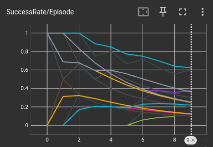
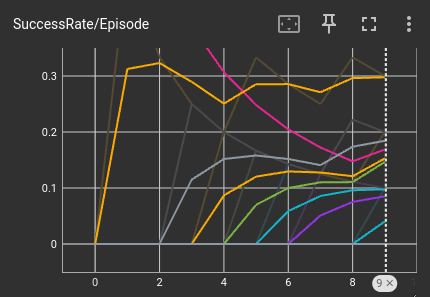
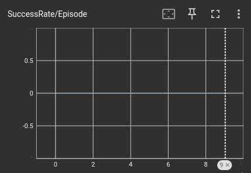
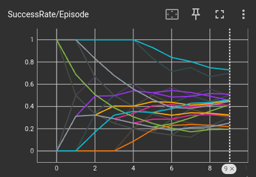
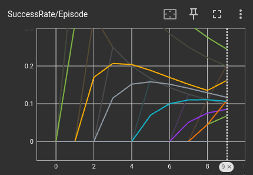
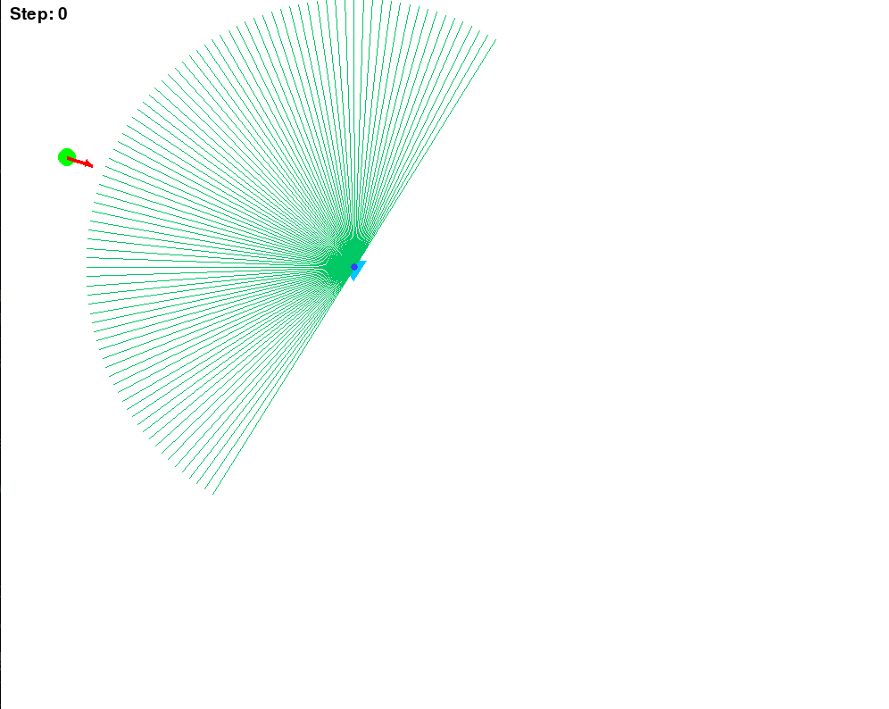

# 強化学習による差動駆動ロボットのナビゲーション学習ステップ分析成果

## 目的

本研究の目的は、ステップ0〜8まで段階的にナビゲーションの難易度を上げつつ追加学習を行い、**最終的には2Dライダーのみの情報で、パラメータなどを一切手動調整せずに自律的にゴールできる差動駆動ロボット台車を作ること**である。

---

## 学習手法の比較

今回、以下の2つのアプローチで強化学習を行った。

### 1. **固定パラメータ方式**（ベーシックQ学習）

- 報酬設計や探索率、状態離散化などを**固定**のまま学習。
- パラメータ・報酬・探索率のチューニングを**行わない**。

[コードはこちら](https://github.com/Saisei2004/nav-rl-qlearning/blob/main/train_rl_o.py)

### 2. **調整型方式**（パラメータ工夫型Q学習）

- 状態離散化・報酬設計・探索率などを**段階的に調整・工夫**し、学習効率と安定性を向上させる工夫を加えた。
[コードはこちら](https://github.com/Saisei2004/nav-rl-qlearning/blob/main/train_rl.py)

---

## 現状の成果

-ステップ1までの学習に少し成功？
-現状によって報酬の値が調整されるようにすることで、ステップ0の成功率を約3倍に、成功率でいうと50％程にすることに成功。
-追加学習や、報酬設計を見直し、エピソード数を増やすことで成果は出せそう。（現在のGPUや少し厳しいかも？）

---

## ステップ毎の結果と成功回数

| ステップ    | 固定パラメータ方式 | 調整型方式   |
|-------------|--------------------|--------------|
| ステップ0   | 23/130             | 70/130       |
| ステップ1   | 14/130             | 7/130        |
| ステップ2   | 0/130              | 0/130        |

---

## グラフ結果・プレイ画面

### 固定パラメータ方式

- ステップ0成功率グラフ  
    
  （例：アップロード画像1枚目をstep0_fixed.pngとして保存）

- ステップ1成功率グラフ  
  

- ステップ2成功率グラフ  
  

### 調整型方式

- ステップ0成功率グラフ  
    
  （例：アップロード画像2枚目をstep0_tuned.pngとして保存）

- ステップ1成功率グラフ  
  

- ステップ2成功率グラフ  
  

### プレイ画面サンプル

- ステップ2のプレイ画面  
  

---

## 考察（グラフから読み取れること）

### ステップ0

- **固定パラメータ方式**では、一部のseedで一時的に高い成功率を示すものの、多くのseedでエピソードを重ねるごとに成功率が低下し、運任せな結果に終わった。
- **調整型方式**では、エピソードを重ねることで安定して高い成功率を維持・向上するseedが増え、学習が安定して進んでいることが明確にグラフに現れている。

### ステップ1

- **固定パラメータ方式**・**調整型方式**ともに、成功率は0.1〜0.3程度までしか向上せず、多くのseedで10〜20%前後で横ばいとなった。
- 調整型方式では、seedによっては初期値よりは改善したものもあるが、タスク難易度上昇に対して大幅なブレイクスルーは見られなかった。

### ステップ2

- 両方式ともに成功回数0、グラフもほぼ全てのseedでゼロのままとなった。

---

## 考察（強化学習手法・工夫の効果）

- 固定パラメータ方式（ベーシックQ学習）は、「学習が進んでも方策が向上せず、ほぼ運任せ」になる傾向が強かった。
- 調整型方式（工夫型Q学習）では、報酬設計や状態離散化・探索率の減衰といった基本的な工夫だけでも「ステップ0」では**明らかに安定した学習・高い成功率**が得られた。
- ただし、ステップ1以降の難易度上昇には既存の調整だけでは不十分であり、さらなる報酬関数の最適化やモデル表現の高度化が必要である。

---

## 今後の課題・展望

- ステップ2以降で全く成功が見られなかったため、**さらなる報酬設計・状態表現の工夫や探索パラメータの見直し**が必要である。
- 本来の最終目標である「**すべてのパラメータフリーなロボットナビゲーションの自動獲得**」に向けて、今後も各ステップごとに学習法・強化学習アルゴリズムの改良を重ねていく予定である。

---

## まとめ

- 固定パラメータ方式では、運任せでしか成功できず、学習の安定化・一般化には至らなかった。
- 調整型方式によって、**学習安定化・初期ステップの高成功率**が得られたが、難易度が上がると依然として改善の余地が大きいことがわかった。
- 強化学習の効果と限界、今後の改良方針について具体的な示唆が得られた。

---
