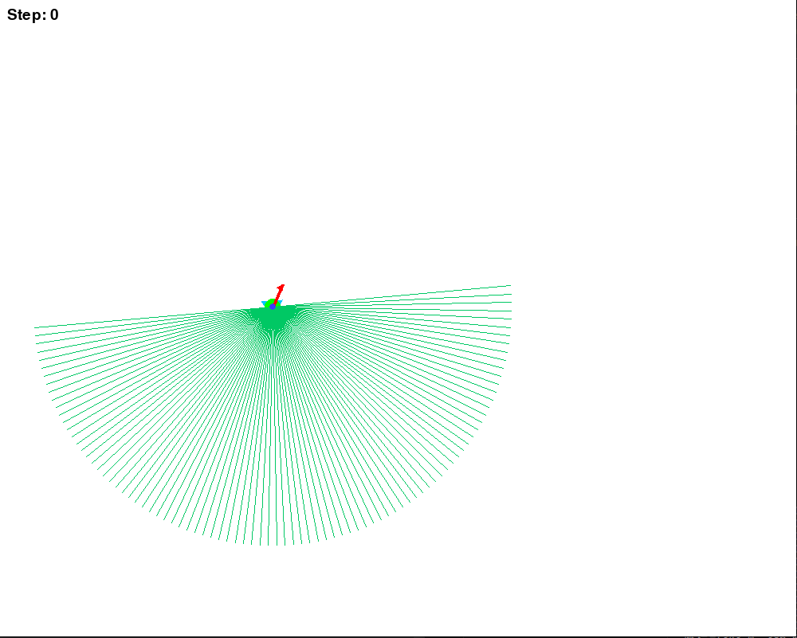
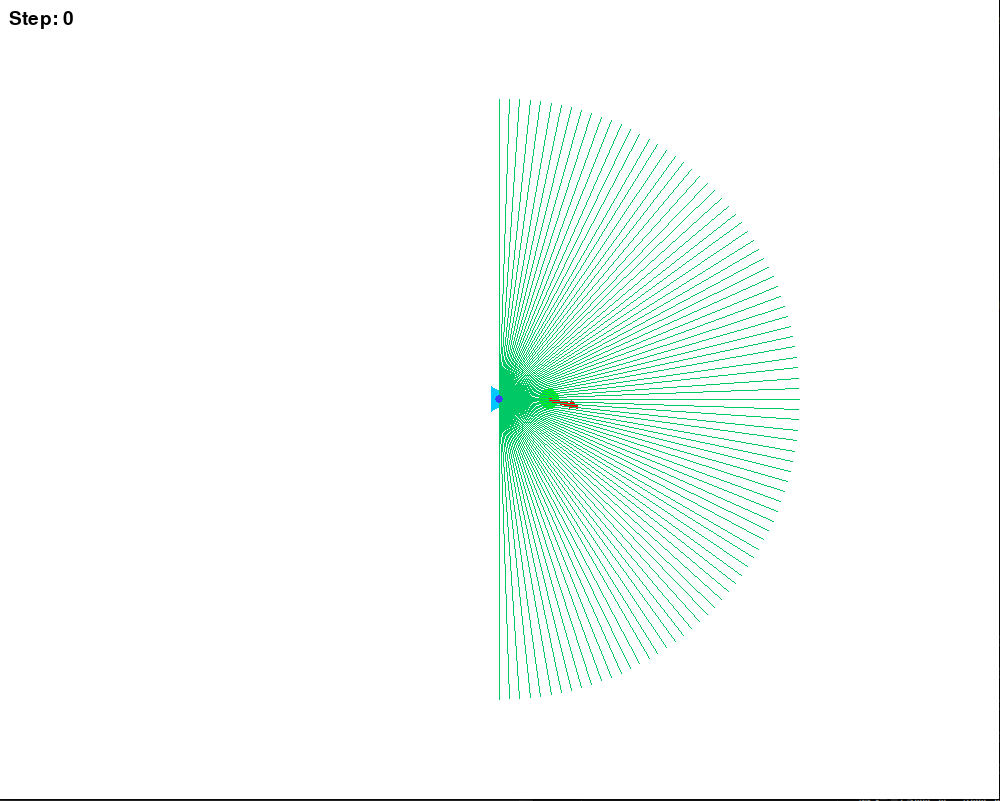
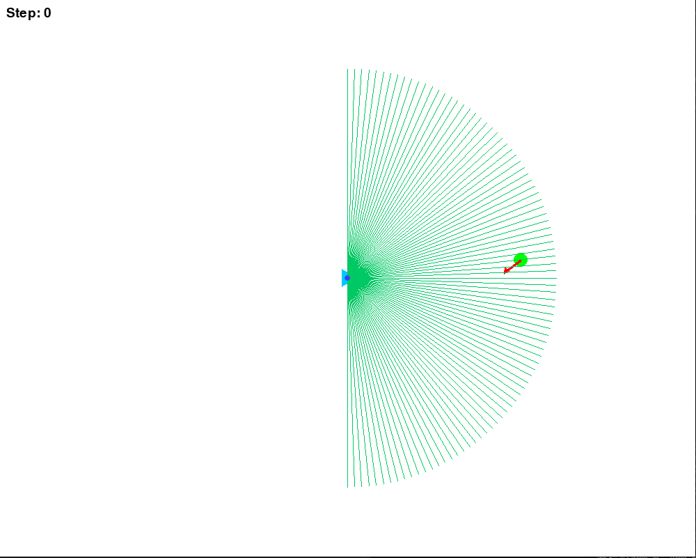
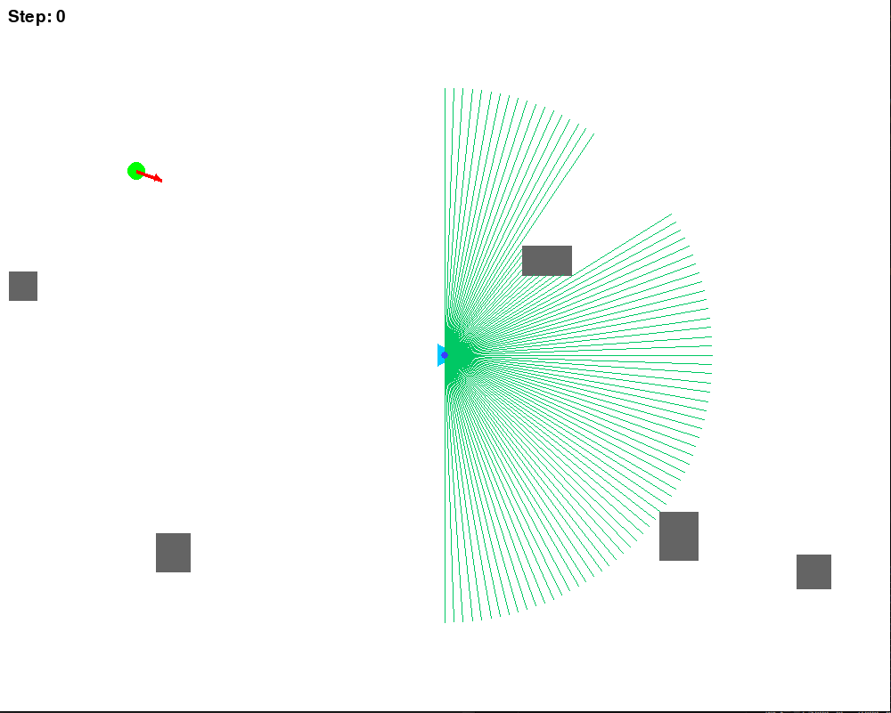
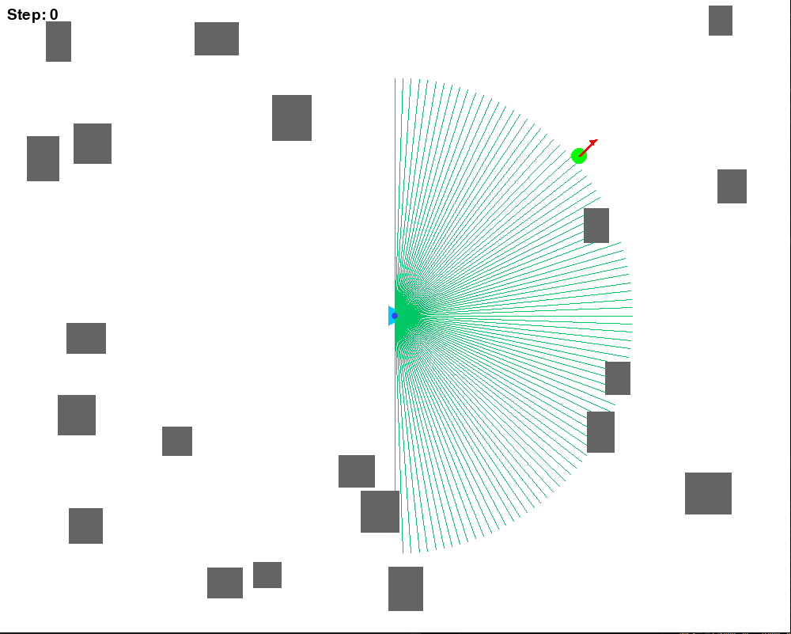
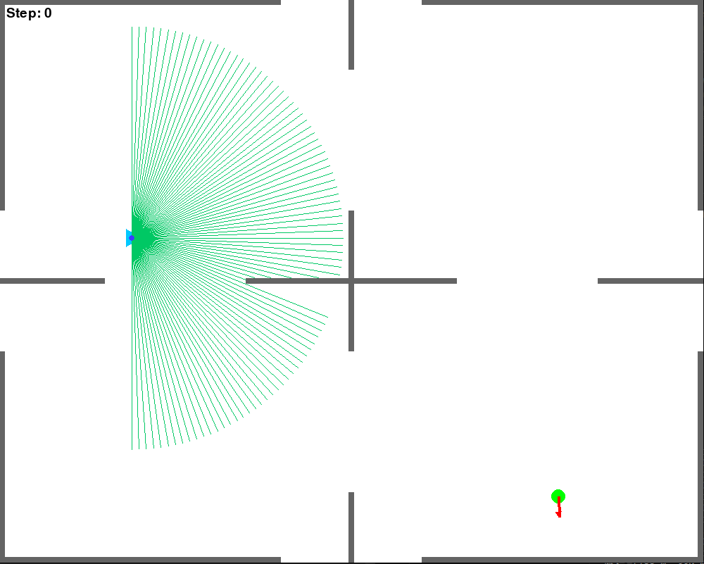
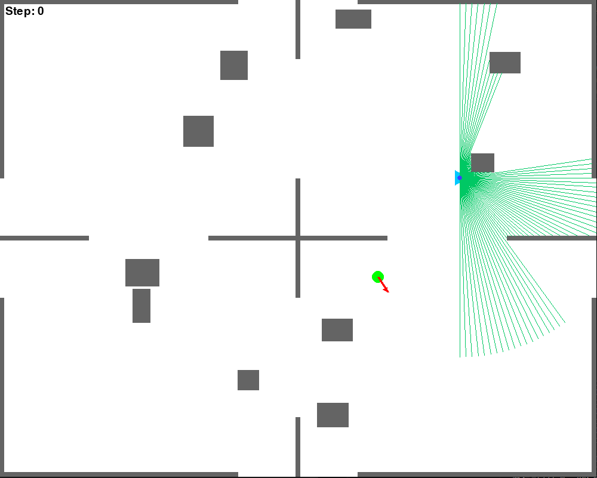
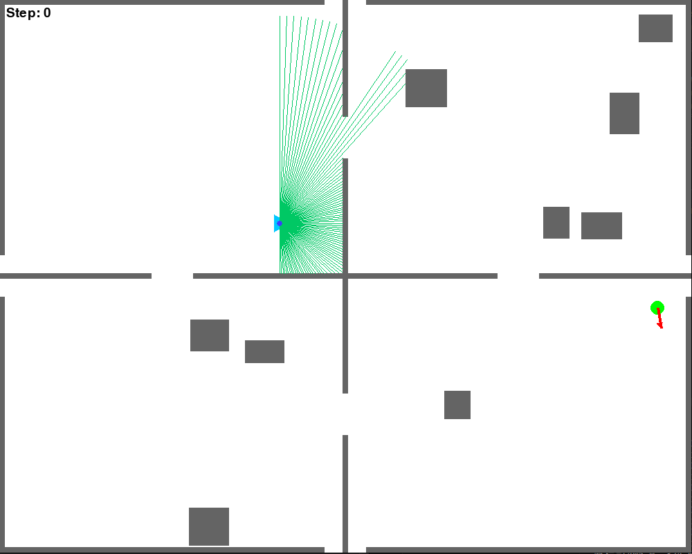
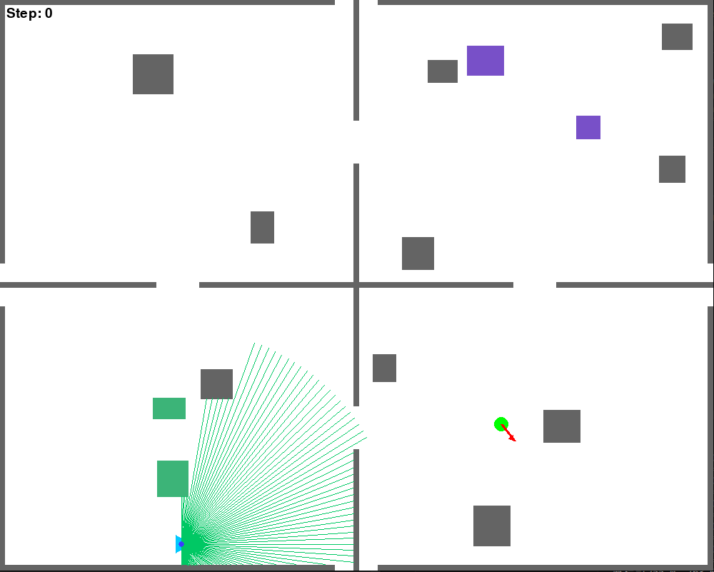

# 各ステップの解説（画像付き・色と挙動解説）

このプロジェクトでは、「Step 0」から「Step 8」まで多様な学習環境が用意されています。
各ステップごとに、**登場する色・形の意味**と「何がどう動くか」まで解説します。

---

## 色と記号の凡例（このREADME内の画像に対応）

* 🟦 **プレイヤー（ロボット）**：水色　…自律移動する主役。自分で操作・学習する対象。
* 🟩 **ゴール**：黄緑色の円　…ここに到達すればクリア。
* 🔺 **赤い矢印**　…ゴールの向き（ロボットがゴールに入るべき向き／向きを認識して報酬を計算）
* 🟩 **黄緑の線**　…2Dライダー（LiDAR）を模したセンサーの深度情報。放射状に障害物までの距離を可視化。
* ⬜ **壁・障害物**：灰色　…通れない。ロボット・動的障害物は反射（跳ね返り）や停止。
* 🟫 **動的障害物A（茶色）**：壁で反射しながら自由に動き回る。
* 🟩 **動的障害物B（緑色）**：決まったパターンで運動する障害物。
* 🟪 **点滅障害物（紫色）**：ランダムまたは周期的に現れたり消えたり（消えてる時は通れる）。

---

# 各Stepの特徴と画像

---

## Step 0：初期向きのみランダム・ゴール重なり

* **特徴**：

  * ゴール（黄緑円）は常にプレイヤー（水色）の位置に重なる。
  * プレイヤーの初期**向きのみランダム**。
  * 障害物・壁は存在しない。
  * ゴールの向き（赤い矢印）は毎回変わる。
* **学べること**：

  * 「向き」を合わせてゴールインする学習。
  * 行動決定における方位制御・回転操作の基礎。

---

## Step 1：ゴール・プレイヤーとも同じ位置

* **特徴**：

  * ゴール（黄緑円）とプレイヤー（水色）は**毎回同じ場所**。
  * 障害物や壁は無し。
  * ゴールの向き（赤い矢印）は毎回変わる。
* **学べること**：

  * Step0とほぼ同じく、方位制御・微調整に集中できる。

---

## Step 2：ゴールの座標がランダム

* **特徴**：

  * ゴール（黄緑円）の位置が毎回ランダム。
  * プレイヤー（水色）は固定。
  * 障害物・壁は無し。
  * ゴールの向き（赤い矢印）は毎回変わる。
* **学べること**：

  * ランダムな位置のゴールまで移動する基礎ナビゲーション。
  * センサーや動作の精度確認。

---

## Step 3：静的障害物（灰色）が追加

* **特徴**：

  * ゴール（黄緑円）とプレイヤー（水色）に加え、
  * **灰色の壁や障害物**がランダム配置。
  * ゴールの向き（赤い矢印）は毎回変わる。
* **学べること**：

  * 静的障害物の回避ルート学習。
  * LiDARによる障害物認識と応答。

---

## Step 4：複雑な静的障害物

* **特徴**：

  * 障害物（灰色）の数や形状が増加。
  * ゴールの位置・向きはランダム。
* **学べること**：

  * より複雑な障害物配置に対する経路探索。
  * 一時的な回避・複数ルート選択の訓練。

---

## Step 5：反射移動（茶色）障害物が登場

* **特徴**：

  * 灰色の壁・障害物＋\*\*茶色の障害物（壁で反射しながら自由移動）\*\*が現れる。
  * ランダムなゴール配置。
* **学べること**：

  * 動く障害物との距離感・タイミング制御。
  * 静的・動的なリスク回避の判断。

---

## Step 6：決まった運動（緑色）障害物が登場

* **特徴**：

  * 壁・障害物（灰色）＋\*\*緑色の障害物（決まったパターン運動）\*\*が出現。
  * ゴールまでの道が毎回異なる。
* **学べること**：

  * 一定周期やルートで動く障害物への対応。
  * 規則的運動パターンの学習。

---

## Step 7：点滅障害物（紫色）が登場

* **特徴**：

  * 壁・障害物（灰色）、緑・茶色の動的障害物＋**紫色の点滅障害物**。
  * 紫色は現れたり消えたりする（消えてる時だけ通過可能）。
* **学べること**：

  * ランダム・周期的な環境変化に応じたタイミング戦略。
  * 消失タイミングの先読みや待機判断。

---

## Step 8：総合課題・複合環境

* **特徴**：

  * これまで登場した**全ての障害物・壁・ゴールの向き**が組み合わさる。
  * 黄緑のゴール、赤矢印の向き、水色のプレイヤー、黄緑線のLiDAR可視化、
  * 灰色（壁/静的障害物）、茶色（反射障害物）、緑色（パターン運動）、紫色（点滅障害物）が同時に存在。
* **学べること**：

  * 複雑な環境下でのナビゲーション・動的回避・総合的な戦略構築。

---

# まとめ

* ステップが進むほど、環境の多様性・難易度が増します。
* 色や形ごとの意味・動き・攻略ポイントを意識して、実環境を想定したロボットナビゲーションを体験できます。
* まずはStep0から順番にチャレンジし、実力に応じて応用力を高めてください！
